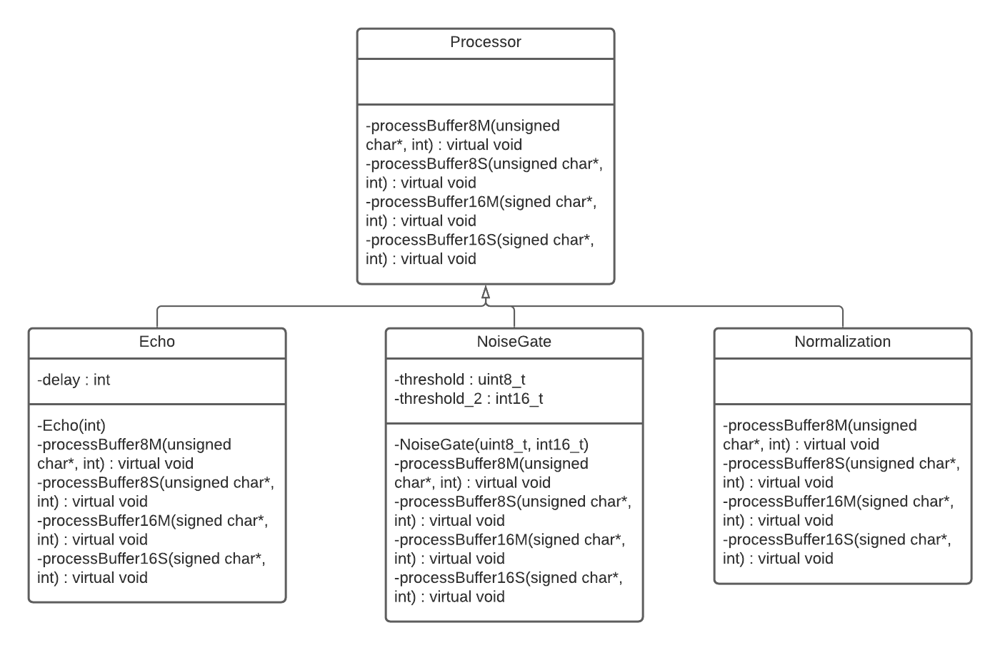

# CS 202 Semester Project Template

## Members included are Joshua Anderson and Caitlin Hibler
###### Joshua's responsibilities - wav files, the ui files, csv files, and the main.cpp file
###### Caitlin's resposibilities - echo files, normalization files, noisegate files, processor files, makefile, and doxygen files
###### There was some help with one another in different files, but they were mainly for minimal changes to make sure that the code worked together.
###### This program is meant to take audio files and alter them in different variations such as echo, normalization, and noisegate. The three variations are meant to work with 8bit/16bit mono/stereo files. The user is also allowed to look into the metadata of the files and alter them if they so choose to do so. 
###### Had some difficulties when it came to the wav files. It works, just a bit of struggle when making it. The translation from the different variations used to alter the 8bit/16bit mono/stereo was acting a bit weird. During compile time, it would only want to make the files for the 8bit mono echo variation. The rest would like the encounter a seg fault. Though I (Caitlin) could not figure out the issue behind.

